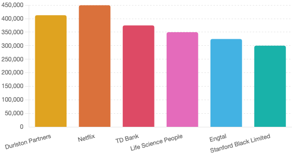
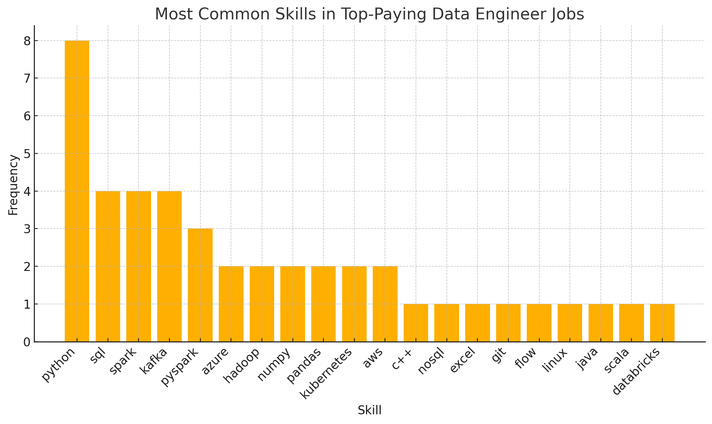

# Introduction
Dive into the data job market! Focusing on data engineering roles, this project
explores top-paying jobs, in-demand skills, and where high demand meets high 
salry in data engineering.

SQL queries? Check them out here: [sql_project folder](/sql_project/)

# Background
This project was inspired by a desire to better navigate the data engineering job market by identifying the most in-demand and highest-paying skills, making it easier for others to find the best job opportunities.

Data hails from [SQL Course](https://lukebarousse.com/sql).

### The quesitons I wanted to asnwer through my SQL queries were:

1. What are the top-paying data engineering jobs?
2. What skills are required for these top-paying jobs?
3. What skills are most in demand for data analysts?
4. Which skills are associated with higher salaries?
5. What are the most optimal skills to learn?

# Tools I Used
For my deep dive into the data engineering job market,
I utilized several key tools:

- **SQL**: The backbone of my analysis, allowing me to query the database and unearth critical insights.
- **PostgreSQL**: The chosen database management system, ideal for handling the job posting data.
- **Visual Studio Code**: My go-to for database management and executing SQL queries.
- **Git & GitHib**: Essential for version control and sharing my SQL scripts and analysis, ensuring collaboration and project tracking.

# The Analysis
Each query for this project aimed at investigating specific aspects of the data engineering job market. Here's how I approached each question:

### 1. Top Paying Data Engineering Jobs
To identify the highest-paying roles, I filtered data engineering positions by average yearly salary and location, focusing on jobs that are remote or are in the New York area. This query highlights the high paying opportunities in the field.

```sql
SELECT
    job_id,
    job_title,
    job_location,
    job_schedule_type,
    salary_year_avg,
    job_posted_date,
    name AS company_name
FROM 
    job_postings_fact
LEFT JOIN company_dim ON job_postings_fact.company_id = company_dim.company_id
WHERE
    job_title_short = 'Data Engineer' AND
    (job_location = 'Anywhere' OR
    job_location = 'New York, NY') AND
    salary_year_avg IS NOT NULL
ORDER BY
    salary_year_avg DESC
LIMIT 10
```
Here's the breakdown of the top data analyst jobs in 2023:
- **Wide Salary Range:** Top 10 paying data engineering roles span from $300,000 to $525,000, indicating significant salary potential in the field.
- **Diverse Employers:** Companies like Durlston Partners, Netflix and TD Bank are among those offering high salaries, showing a broad interest across different industries.


*Bar graph visualizing the salary for the top 10 salaries for data engineers; ChatGPT generated this graph from my SQL query results*

### 2. Skills for Top-Paying Jobs
To understand which technical skills are most valuable, I analyzed the top 10 highest-paying Data Engineer roles (as identified in the previous query) and extracted the specific skills required for each. This breakdown provides insight into the skill sets that align with top-tier salaries, helping job seekers prioritize what to learn or strengthen in order to qualify for these lucrative opportunities.
```sql
WITH top_paying_jobs AS (

    SELECT
        job_id,
        job_title,
        salary_year_avg,
        name AS company_name
    FROM 
        job_postings_fact
    LEFT JOIN company_dim ON job_postings_fact.company_id = company_dim.company_id
    WHERE
        job_title_short = 'Data Engineer' AND
        (job_location = 'Anywhere' OR
        job_location = 'New York, NY') AND
        salary_year_avg IS NOT NULL
    ORDER BY
        salary_year_avg DESC
    LIMIT 10
)

SELECT
    top_paying_jobs.*,
    skills
FROM top_paying_jobs
INNER JOIN skills_job_dim ON top_paying_jobs.job_id = skills_job_dim.job_id
INNER JOIN skills_dim on skills_job_dim.skill_id = skills_dim.skill_id
ORDER BY
    salary_year_avg DESC
```
Here's a breakdown of the of the most demanded skills for the top 10 highest paying data engineering jobs in 2023:

- **Python** is leading with a count of 8
- **SQL** follows it with a count of 4 just like **Spark**, and **Kafka**
- Other skills such as **PySpark**, **C++**, and **Numpy** show varying degrees of demand



*Bar graph visualizing the frequency for the top 10 skills for data engineers; ChatGPT generated this graph from my SQL query results*

### 3. Most In-Demand Skills
To identify the skills most frequently requested in data engineering job postings, I joined the job postings data with skill mappings and filtered for roles labeled "Data Engineer" that are either remote or based in New York, NY. This query returns the top 5 skills with the highest demand, offering job seekers valuable insight into which competencies are most valued across the industry.

```sql
SELECT
    skills,
    COUNT(skills_job_dim.job_id) AS demand_count
FROM job_postings_fact
INNER JOIN skills_job_dim ON job_postings_fact.job_id = skills_job_dim.job_id
INNER JOIN skills_dim on skills_job_dim.skill_id = skills_dim.skill_id
WHERE
    job_title_short = 'Data Engineer' AND
    (job_work_from_home = true OR job_location = 'New York, NY')
GROUP BY
    skills
ORDER BY
    demand_count DESC
LIMIT 5
```
Here's a breakdown of the most demanded skills for Data Engineers is 2023:
- **SQL** and **Python** remain fundumental forming the backbone of data querying and scripting in most data pipelines.
- Cloud and big data tools like **AWS**, **Azure**, and **Spark** are also in high demand, reflecting the industry's shift toward scalable, cloud-based data solutions.

| Skill   | Demand Count |
|---------|--------------|
| SQL     | 15,169       |
| Python  | 14,916       |
| AWS     | 9,208        |
| Azure   | 7,406        |
| Spark   | 7,103        |

### 4. Skills with Higher Salaries
To determine which skills are most closely associated with higher salaries, I analyzed the average yearly salary for Data Engineer roles that list specific skill requirements. This query focuses on positions with disclosed salary information, in the New York area or is remote, and identifies the top 25 skills ranked by average salary. The results offer insight into which skills may provide the greatest financial return, guiding job seekers on which areas to invest their time and effort.

```sql
SELECT
    skills,
    ROUND(AVG(salary_year_avg), 2) AS avg_salary
FROM job_postings_fact
INNER JOIN skills_job_dim ON job_postings_fact.job_id = skills_job_dim.job_id
INNER JOIN skills_dim on skills_job_dim.skill_id = skills_dim.skill_id
WHERE
    job_title_short = 'Data Engineer' 
    AND salary_year_avg IS NOT NULL
    AND (job_work_from_home = true OR job_location = 'New York, NY')
GROUP BY
    skills
ORDER BY
    avg_salary DESC
LIMIT 25
```
Here's a breakdown for top paying skills for Data Engineers:
- **Specialized and Niche Tools Pay Big**: Skills like SPSS, Rust, Clojure, and ggplot2 top the salary charts, reflecting their high value in analytics-heavy or specialized domains despite lower general usage.
- **Modern Web and Programming Tools Are Lucrative**: Technologies such as Vue, Angular, GraphQL, and Solidity offer strong salaries, showing that crossover skills in web development and decentralized applications are well-compensated in data roles.
- **Infrastructure and Cloud Skills Remain Highly Valuable**: Tools like Kubernetes, Terraform, Kafka, and Cassandra consistently offer salaries above $150K, underlining the continued demand for data engineers skilled in scalable, production-grade systems.

| Rank | Skill       | Average Salary (USD) |
|------|-------------|-----------------------|
| 1    | SPSS        | $225,000.00           |
| 2    | Vue         | $200,000.00           |
| 3    | Mongo       | $184,031.91           |
| 4    | ggplot2     | $176,250.00           |
| 5    | Rust        | $172,819.17           |
| 6    | Clojure     | $170,866.50           |
| 7    | Perl        | $169,000.00           |
| 8    | Angular     | $168,212.50           |
| 9    | GraphQL     | $168,037.50           |
| 10   | Solidity    | $166,250.00           |
| 11   | Assembly    | $164,378.33           |
| 12   | Julia       | $160,500.00           |
| 13   | Splunk      | $160,397.14           |
| 14   | Bitbucket   | $160,333.33           |
| 15   | Kubernetes  | $159,848.31           |
| 16   | Neo4j       | $159,315.95           |
| 17   | Zoom        | $159,000.00           |
| 18   | MXNet       | $157,500.00           |
| 19   | FastAPI     | $155,714.29           |
| 20   | Trello      | $155,000.00           |
| 21   | CodeCommit  | $155,000.00           |
| 22   | NumPy       | $153,419.50           |
| 23   | Cassandra   | $153,226.94           |
| 24   | Terraform   | $152,864.27           |
| 25   | Kafka       | $152,568.69           |

### 5. Optimal Skills for Job Market Value
 To uncover the most strategic skill sets for career advancement in data engineering, I combined demand and compensation metrics. This query gives the top 25 skills most prevalent in job postings and have the highest average salary values. Comparing remote positions and New York, NY positions, both of which have shared salary information it shows skills with great job stability as well as high monetary rewards. These are the most "optimal" ones to learn or enhance for future and existing Data Engineers.

```sql
SELECT
    skills_dim.skill_id,
    skills_dim.skills,
    COUNT(skills_job_dim.job_id) AS demand_count,
    ROUND(AVG(job_postings_fact.salary_year_avg), 2) AS avg_salary
FROM job_postings_fact
INNER JOIN skills_job_dim ON job_postings_fact.job_id = skills_job_dim.job_id
INNER JOIN skills_dim ON skills_job_dim.skill_id = skills_dim.skill_id
WHERE
    job_title_short = 'Data Engineer'
    AND salary_year_avg IS NOT NULL
    AND (job_work_from_home = True OR job_location = 'New York, NY')
GROUP BY
    skills_dim.skill_id
HAVING
    COUNT(skills_job_dim.job_id) > 10
ORDER BY
    avg_salary DESC,
    demand_count DESC
LIMIT 25
```
Here's a breakdown for the most optimal skills for Data Engineers in 2023:
- **Core Skills Are a Must-Have**: SQL, Python, and AWS dominate in demand, each appearing in hundreds of postings. While their salaries hover around $132K–$137K, their ubiquity makes them essential foundational skills for any data engineer.
- **Modern Data Stack Skills Pay More**: Tools like Airflow, Kafka, Pyspark, Scala, and Databricks offer higher average salaries (often >$140K), highlighting the growing value of modern data orchestration, streaming, and analytics platforms in engineering pipelines.
- **Cloud Platforms and BI Tools Show Strong but Varied Value**: Azure, GCP, Snowflake, and Kubernetes all show solid demand with strong pay, while BI tools like Tableau and Power BI are still relevant but yield lower average salaries, indicating a stronger financial incentive for backend and infrastructure expertise.

| Rank | Skill      | Demand Count | Average Salary (USD) |
|------|------------|---------------|------------------------|
| 1    | sql        | 683           | $132,524.46            |
| 2    | python     | 671           | $137,134.17            |
| 3    | aws        | 456           | $136,972.33            |
| 4    | azure      | 298           | $133,483.95            |
| 5    | spark      | 297           | $141,290.54            |
| 6    | snowflake  | 240           | $137,234.87            |
| 7    | airflow    | 192           | $138,592.71            |
| 8    | java       | 184           | $143,080.59            |
| 9    | redshift   | 177           | $135,381.38            |
| 10   | kafka      | 161           | $152,568.69            |
| 11   | databricks | 148           | $133,433.46            |
| 12   | scala      | 139           | $146,037.75            |
| 13   | hadoop     | 123           | $140,737.99            |
| 14   | nosql      | 120           | $143,180.68            |
| 15   | tableau    | 106           | $118,883.17            |
| 16   | gcp        | 104           | $136,204.18            |
| 17   | sql server | 96            | $124,865.01            |
| 18   | git        | 89            | $131,133.94            |
| 19   | docker     | 85            | $134,917.29            |
| 20   | pyspark    | 83            | $145,421.57            |
| 21   | power bi   | 77            | $119,463.29            |
| 22   | kubernetes | 74            | $159,848.31            |
| 23   | r          | 73            | $126,886.37            |
| 24   | oracle     | 72            | $125,669.94            |
| 25   | mysql      | 71            | $136,831.47            |

# What I learned
Throughout this adventure, I've turbocharged my SQL toolkit with some serious firepower:

- **Advanced Query Building:** Gained expertise in writing complex SQL queries, seamlessly joining tables and using WITH clauses for efficient temporary data handling.
- **Data Aggregation:** Became proficient with GROUP BY and aggregate functions like COUNT() and AVG() to effectively summarize and analyze data.
- **Analytical Problem-Solving:** Enhanced my ability to translate real-world questions into clear, actionable SQL queries that deliver meaningful insights.

# Conclusion
### Insights
1. **Top-Paying Data Engineer Jobs**: The highest-paying jobs for data engineers that are in the New York are or are remote offer a wide range of salries, the highest at $525,000!
2. **Skills for Top-Paying Jobs**: High paying data engineer jobs require advanced proficiency in Python, suggesting it's a critical skill for earning a top salary.
3. **Most In-Demand Skills**: SQL is also the most demanded skill in the data engineer job market, thus making it essential for job seekers.
4. **Skills with Higher Salaries**: Specialized skills, such as SPSS and Vue, are associated with the highest average salaries, indicateing a premium on niche expertise.
5. **Optimal Skills for Job Market Value**: SQL leads in demand and offers for a high average salary, positioning it as on of the most optimal skills for data engineers to learn to maximize their market value

### Closing Thoughts

This project enhanced my SQL skills and provided valuable insights into the data engineering job market. The findings from the analysis serve as a guide to prioritizing skill development and job search efforts. Aspiring data engineers can better position themselves in a competetive job market by focusing on high-demand, high-salary skills. This exploration highlights the importance of continuous learning and adaptation to emerging trends in the field of data engineering.
